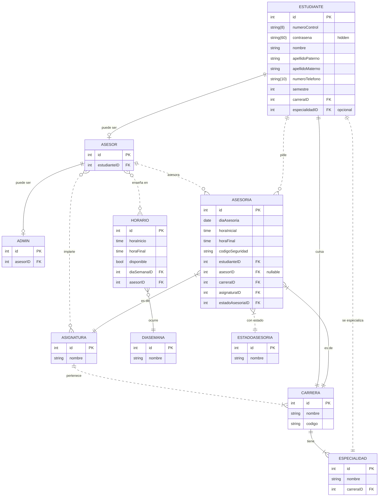

# Descripción de Estado

En el _ITV_ existen varias 13 **carreras** de alguna ingeniería o licenciatura, de las cuales en sus programas poseen diferentes **asignaturas**, acorde a lo establecido por el Sistema Nacional de Tecnológicos de México. Algunas **asignaturas** son únicas de alguna **carrera**, mientras otras son compartidas, o se consideran de tronco común; es necesario que existan en el programa de todas las **carreras**. Las **carreras** tienen ciertas **especialidades** como extensión de sus programas de estudio.

Un **estudiante** estudia alguna de las **carreras** y debe seguir su programa de estudios, por lo que puede que necesite ayuda en alguna de estas **asignaturas**. Un **asesor** es un **estudiante** del _ITV_ que forma parte de _PADIEER_, y puede enseñar acerca de **asignaturas** pertenecientes a su **carrera**.

Una **asesoría** es un tiempo de enseñanza impartido por un **asesor** acerca de alguna **asignatura**, hacia uno o más **estudiantes** en un **horario** establecido previamente. Los **horarios** pueden ser desde 8am hasta 8pm, de lunes a viernes. El **estudiante** pide la **asesoría**, y debe esperar a ser notificado para saber quien será su **asesor.**

Un **admin** o **administrador** es un **asesor** encargado del programa de asesorías, y puede designar un **asesor** a **asesorías** pedidas por **estudiantes**. El **admin** escoge a un **asesor** apropiado en base primero de sus **horarios** y si puede enseñar la **asignatura** solicitada, y en caso de no encontrar un asesor con tales cualidades, uno que pueda enseñar dicha asignatura, y si no hay otro, que pertenezca a la misma **carrera** del **estudiante** que solicitó la **asesoría**. Si no hay asesores disponibles, entonces puede escoger a cualquiera, o cancelar la **asesoría**.

Una **asesoría** inicialmente está en **estado _pendiente_**; sin importar que tenga un **asesor** asignado; en **estado _en proceso_**, cuando el **asesor** indique que empezó la asesoría en el la fecha y hora establecida, en **estado _terminado_** una vez que se confirme que terminó la asesoría, ó en **estado _cancelado_** en cualquier momento de la existencia de la asesoría.

Una **asesoría** puede ser cancelada por las siguientes razones:
- Un administrador cancela la asesoría
- El estudiante que pidió la asesoría la cancela
- El asesor asignado cancela la asesoría

Para confirmar que se terminó con éxito la **asesoría**, el **asesor** debe compartir un código al **estudiante**, y una vez confirmado el código, el estudiante termina la asesoría. Sólo se puede terminar una asesoría que esté **_en proceso_**.

Las **asesorías** terminadas con éxito se consideran como una hora de servicio para el **asesor** que la impartió, y con 200 horas de servicio libera su servicio social de su programa de estudios. Si un **asesor** asesora a varios **estudiantes** en una misma hora, entonces recibe una hora de servicio por cada **estudiante**.

Un **administrador** puede añadir o restar horas de servicio a un **asesor**.

## Diagrama de Estado

